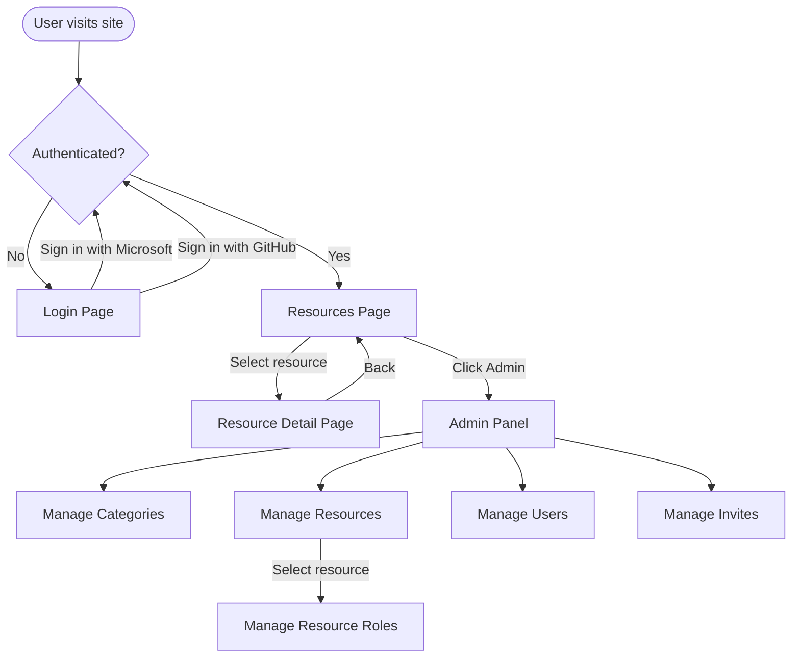

# UI Design

## Navigation Flow

## Screens

### Login Page
- Shown when the user is not authenticated
- Two sign-in buttons: Microsoft and GitHub
- Error message displayed if auth fails or an invite is required

### Resources Page (Home)
- Lists all available resources as cards
- Category filter bar at the top (All / category buttons)
- Each card shows resource name, description
- Clicking a card navigates to the resource detail page
- **Admin link** visible for users with any admin role

### Resource Detail Page
- Shows resource name for description
- **Bookings list** for the current month
  - Each booking shows title, time range, and owner
  - Delete button on bookings owned by the user (or if user is a manager)
- **New Booking form**
  - Title (required, max 30 chars)
  - Description (optional, max 1000 chars)
  - Start date/time
  - End date/time
  - Error display for overlaps and validation

### Admin Panel
Accessible only to users with admin roles. Shows tabs/sections based on the user's roles:

#### Manage Categories *(requires category-admin)*
- List of existing categories (name + icon)
- Create new category (name, icon)
- Edit category name/icon
- Delete category

#### Manage Resources *(requires resource-admin)*
- List of existing resources (name, category, description)
- Create new resource (name, category, description, image URL)
- Edit resource
- Delete resource
- **Manage Roles** button per resource → Resource Roles sub-page

#### Resource Roles *(requires resource-admin)*
- List of users assigned to the selected resource (user name, role)
- Add user to resource (select user, assign role: user or manager)
- Change role
- Remove user from resource

#### Manage Users *(requires user-admin)*
- List of all users (display name, identity provider, roles)
- Edit user app roles (user-admin, category-admin, resource-admin)
- Remove user

#### Manage Invites *(requires user-admin)*
- List of active invite links (ID, expiry, used by)
- Create new invite (validity in days)
- Delete/revoke invite
- Copy invite link to clipboard

## Role Visibility

| Screen / Feature | Required Role |
|---|---|
| Login, Resources, Resource Detail | Any authenticated user |
| Create/delete own bookings | Resource role: `user` or `manager` |
| Delete others' bookings | Resource role: `manager` |
| Admin Panel link | Any admin role |
| Manage Categories tab | `category-admin` |
| Manage Resources tab | `resource-admin` |
| Manage Resource Roles | `resource-admin` |
| Manage Users tab | `user-admin` |
| Manage Invites tab | `user-admin` |

## Missing API Endpoints

The following endpoints are needed to support the admin UI but don't exist yet:

| Endpoint | Method | Purpose |
|---|---|---|
| `/api/resources/{id}/roles` | GET | List roles for a resource |
| `/api/resources/{id}/roles` | POST | Assign a user to a resource |
| `/api/resources/{id}/roles/{roleId}` | PUT | Update a user's role |
| `/api/resources/{id}/roles/{roleId}` | DELETE | Remove a user from a resource |
| `/api/users` | GET | List all users |
| `/api/users/{id}` | PUT | Update user app roles |
| `/api/users/{id}` | DELETE | Remove a user |
