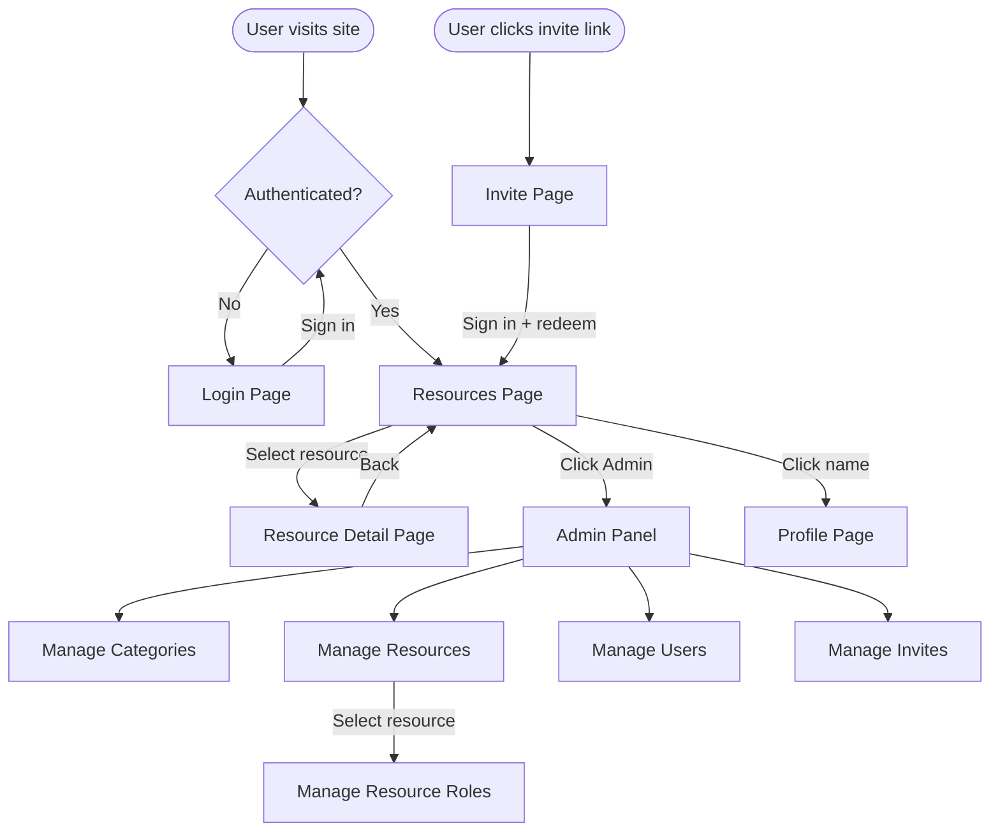

# UI Design

## Navigation Flow

## Screens

### Login Page
- Shown when the user is not authenticated
- Two sign-in buttons: Microsoft and GitHub
- Error message displayed if auth fails or an invite is required

### Invite Page
- Landing page for invite links (`/invite/:id`)
- Stores invite ID in localStorage, shows sign-in buttons
- After authentication, AuthContext reads invite from localStorage and redeems it

### Profile Page
- Accessible by clicking user name in the header
- Edit display name
- Shows identity provider and member-since date

### Resources Page (Home)
- Lists resources the user has access to (filtered by resource roles; resource admins see all)
- Category filter bar at the top (All / category buttons)
- Each card shows resource image (if set), name, description
- Clicking a card navigates to the resource detail page
- **Admin link** visible for users with any admin role
- Header shows "Sharing is Caring" (or "S=C" on narrow screens), with user name linking to profile

### Resource Detail Page
- Shows resource name, image (if set), and description
- **Bookings list** with two views:
  - "Next 12 months" (default): today to +1 year
  - "Show all": 90 days back to unlimited future
  - Each booking shows title, expandable description (▸/▾ toggle), time range, and creator name
  - Past bookings (end time passed) are dimmed and cannot be edited or cancelled
  - Edit and Cancel buttons visible for the booking owner or resource managers
- **Booking form** (New / Edit)
  - Title (required, max 30 chars)
  - Description (optional, max 1000 chars)
  - Start date/time
  - End date/time
  - Error display for overlaps and validation
  - When editing, form pre-fills with booking data and shows "Update" / "Cancel Edit"

### Admin Panel
Accessible only to users with admin roles. Shows tabs/sections based on the user's roles:

#### Manage Categories *(requires category-admin)*
- List of existing categories (name + icon)
- Create new category (name, icon)
- Edit category name/icon
- Delete category

#### Manage Resources *(requires resource-admin)*
- List of existing resources (name, category, description)
- Create new resource (name, category, description, image URL)
- Edit resource
- Delete resource
- **Manage Roles** button per resource → Resource Roles sub-page

#### Resource Roles *(requires resource-admin)*
- List of users assigned to the selected resource (user name, role)
- Add user to resource (select user, assign role: user or manager)
- Change role
- Remove user from resource

#### Manage Users *(requires user-admin)*
- List of all users (display name, identity provider, roles)
- Click display name to edit it inline
- Edit user app roles (user-admin, category-admin, resource-admin)
- Cannot remove your own user-admin role
- Remove user

#### Manage Invites *(requires user-admin)*
- List of active invite links (ID, expiry, used by)
- Create new invite (validity in days)
- Delete/revoke invite
- Copy invite link to clipboard

## Role Visibility

| Screen / Feature | Required Role |
|---|---|
| Login, Resources, Resource Detail | Any authenticated user |
| Edit/delete own bookings | Resource role: `user` or `manager` |
| Edit/delete others' bookings | Resource role: `manager` |
| Edit/delete past bookings | Not allowed |
| Admin Panel link | Any admin role |
| Manage Categories tab | `category-admin` |
| Manage Resources tab | `resource-admin` |
| Manage Resource Roles | `resource-admin` |
| Manage Users tab | `user-admin` |
| Manage Invites tab | `user-admin` |

## Missing API Endpoints

All endpoints listed below have been implemented.
